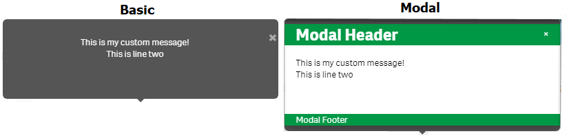

#  Qlik Extension - PopupMessage

This topic [Custom Pop up message on Opening QlikSense App](https://community.qlik.com/t5/Qlik-Sense-App-Development/Custom-Pop-up-message-on-Opening-Qliksense-App/m-p/1706042)
was created at the [Qlik Community Forums](https://community.qlik.com/t5/Qlik-Data-Analytics-Forums/ct-p/qlik-data-analytics) on 25.May.2020 asking for help on creating popup messages when opening a QlikSense application and a KPI failed a business monitoring rule. The current version of QlikSense does not support such a feature out of the box, the alternative was finding an extension to resolve this requirement, unfortunately there was not any.

This extension was written to fill the missing feature of popping a message when a KPI fails to meet some business rules. It allows you to embed the component containing the compromised KPI.

## Overview
This is how the popup message appears on your application's sheet.
# 

The <i>Extension</i> renders up to two panels, one of the with the <i>KPI information</i>, the second one with a <i>Customer Message</i> that you define. You manage this information by using the *Extension*'s properties, you can control the rendering sequence of these panels by setting the appropriated property.

You can also customize your *Custom Message* as the *Extension* features two styles of rendering it, the screenshot below illustrate them.
# 
The <i>Extension</i> was developed using the <i><b>Basic Visualization Template</b></i> with this approach the <b>paint</b> function handles the <i>Extension</i>'s rendering.
## Properties

The Extension implements several properties allowing you to fine tune its behaviour, they are organized in 4 sections:
<ul>
<li>Business Rule Object</li>
<li>Custom Message</li>
<li>Message Attributes</li>
<li>Extension Messages</li>
</ul>

##### Business Rule Object
This Section defines the properties controlling the Sheet's KPI object to become part of the *Popup Message* and the rules to trigger its display, it also allows us to define a couple of Qlik's variables required by the *Extension* to work. 
<table style="font-family: Calibri; border-collapse: collapse;">
  <tr style="font-family: Tahoma; font-size: 13px; background-color: #bfbfbf;">
	<th>Property</th>
	<th>Description</th>
  </tr>
  <tr>
	<td style="vertical-align: text-top;">KPI Current Object</td>
	<td>This is the URL of the KPI object you want to include in the <i>Popup Message</i>, this URL is found in the object's <b> Embed chart</b>; you get this information by right-click on the object when on the front-end user interface  while not in edit mode.   
<b>Default Value: </b>Nothing (no default value)  
<b>Example</b> 
  <pre style="border=1px solid;">
='http://localhost:4848/single/?appid=C%3A%5CUsr%5CQlikResources%5CQlikCommunity%5CDev%5C98.Apps %5C02.Popup%20Help.qvf&obj=Qgvq&opt=ctxmenu,currsel'</pre></td>
  </tr>
  <tr>
	<td>Limit Expression</td>
	<td>This <i>property</i> allows you to enter the conditional expression that will be use to assemble the <i>Popup Message</i> with the message; this message consist of two elements, the KPI object you entered at the previous property and your <i>Custom Message</i>.   

If the <i>Limit Expression</i> is not satisfied (returned <b>false</b>) the message <b><i>Working Fine</i></b> is the one used.	 

<b>Default Value: </b>Nothing (no default value) 

<b>Example</b> 
<pre border="1">=Sum(Value) > 45</pre>
</td>
  </tr>
  <tr>
	<td>KPI Expression</td>
    <td>This is an optional property, the <i>extension</i> allows you to pass the expression defining your KPI, this expression should start with an equal sign; It represent the current KPI value, the <i>extension</i> uses this information to compare with the previous figure saved into the <b>Previous KPI Variable</b>; the message is assembled when these figures do not match.  
If the KPI expression is absent, the <i>Limit Expression</i> is the only one triggering the rendering of the popup message.

<b>Default Value: </b>Nothing (no default value)  
<b>Example</b> 
<pre>=Sum(Value)</pre>
</td>
  </tr>
  <tr>
	<td>Previous KPI Variable</td>
	<td>This property identify application's variable to use when preserving the result of the <i>KPI Expression</i>; so the <i>Extension</i> will be able to compare the current and previous KPI figures.  
If this property is unassigned, the <i>Current KPI Figure</i> is discarded; you can create this variable at the <i>Front-End User Interface</i> or by the <i>Load Script</i>.  
The first time you land on the sheet this variable contains a zero (or the previously saved figured), it gets updated when you navigate out of the sheet and returns back into it, so a second popup message will be prevented.  
<b>Default Value: </b>Nothing (no default value)  
<b>Example</b>
<pre>vPreviousKPI</pre>
    </td>
  </tr>
  <tr>
	<td>Last Check Variable</td>
    <td>This property allows you to collect the stamped time when the <i>Extension</i> was ran, it is just for information only, it give us some feedback about the <i>Extension</i> execution. 

If this property is unassigned, the <i>Last Execution Time</i> is not returned; you can create this variable at the <i>Front-End User Interface</i> or by the <i>Load Script</i>. 

<b>Default Value: </b>Nothing (no default value) 

<b>Example</b> 
<pre>vLastCheck</pre>
</td>
  </tr>
</table>

##### Custom Message
This section defines the properties controlling the custom message you want the <b>PopupMessage</b> extension to display; You can type in the text, or your application could build it within the <i>Front-End User Interface</i> or by its <i>Load Script</i>
# 
<table style="font-family: Calibri; border-collapse: collapse;">
  <tr style="font-family: Tahoma; font-size: 13px; background-color: #bfbfbf;">
	<th>Property</th>
	<th>Description</th>
  </tr>
  <tr>
	<td>Content Message</td>
	<td>This is the message to be displayed as your <i>Custom Message</i>, you type here whatever fit your needs, it could also be one of your application's variables.  

<b>Default Value: </b>Nothing (no default value)  
<b>Example</b> 
<pre>=&#39;&#60;p>&#38;nbsp;&#60;/p>&#60;p>This is my custom message!&#60;/p>&#60;p>This is line two&#60;/p>&#60;p>&#38;nbsp;&#60;/p>&#39;</pre>

Play special attention to this message, it is actually a four lines message with empty lines at the top and bottom of the message; this string '<b>&#60;p>&#38;nbsp;&#60;/p></b>' indicates a non-breakable white space, while those <b>&#60;p></b> and <b>&#60;/p></b> define a paragraph. 
</td>
  </tr>
  <tr>
	<td>Modal Header</td>
	<td>This is the text to be displayed on the <i>Custom Message</i> Header panel, it is freeform, and expected to be one line of text.  
<b>Default Value: </b>Nothing (no default value)  
<b>Example</b>
<pre>Modal Header</pre>
    </td>

  </tr>
  <tr>
	<td>Modal Footer</td>
	<td>This is the text to display at the botton of a <i>Modal Custom Message</i>, it is free form, and expected to be one line of text.  
<b>Default Value: </b>Nothing (no default value)  
<b>Example</b>
<pre>Modal Footer</pre>
	</td>
  </tr>
  <tr>
	<td>HDR-Footer Foreground</td>
	<td>This color picker property let us define the foreground colour of the Header and Footer panels, you got freedom to configure your <i>Custom Message</i> look.  
<b>Default Value: </b>#ffffff (white)
</td>
  </tr>
  <tr>
	<td>HDR-Footer Background</td>
	<td>This color picker property let us define the background colour of the Header and Footer panels in our <i>Custom Message</i> giving us freedom to customize it even further.  
<b>Default Value: </b> #009845 (Qlik's green)
</td>
  </tr>
</table>

##### Message Attributes
This section allows you specify properties concerning to the message's attributes.
<table style="font-family: Calibri; border-collapse: collapse;">
  <tr style="font-family: Tahoma; font-size: 13px; background-color: #bfbfbf;">
	<th>Property</th>
	<th>Description</th>
  </tr>
  <tr>
	<td>Popup Style</td>
	<td>Your <i>Custom Message</i> could be rendered in two styles, Basic and Modal, as shown below:  
 
<b>Default Value: </b>Basic Style
</td>
  </tr>
  <tr>
	<td>Panels to Render</td>
	<td>This <b>Popup Message</b> features two panels, one designed to contain one of your Application's Sheet KPI and a Custom Message; you can configure the <i>extension</i> with this property by indicating which panel you want to render, you got 3 choices:
<ol><li>KPI panel</li><li>Custom Message Panel</li><li>Both Panels</li></ol>
<b>Default Value: </b>Both Panels
</td>
  </tr>
  <tr>
	<td>Render Sequence</td>
	<td>This property allow us to control how these two panels are rendered on the front-end user interface, it gives us two options, you select the panel you want to be rendered first: 
<ol><li>KPI Panel</li><li>Custom Message Panel</li></ol>
<b>Default Value: </b>Custom Message Panel</td>
  </tr>
  <tr>
	<td>Show Prompt</td>
	<td>This <i>Extension</i> has two behaviour approach, its first approach shows a prompt for the user to click triggering the popup, the second approach shows the popup message automatically when the KPI Limit fails. 
If you want an automatic popup message when a KPI is not fulfilled turn-off the <i>Show Prompt</i> attribute.
 
<b>Default Value: </b>Show Prompt
</td>
  </tr>
  <tr>
	<td>Prompt Label</td>
	<td>You can customize the text of the prompt to whatever suits your application needs.  
<b>Default Value: </b>Press Me</td>
  </tr>
  <tr>
	<td>Width</td>
	<td>This property set the width of your <i>popup message</i>.  
<b>Default Value: </b>350 
<b>Minimum Value: </b>20 (a very narrow message) 
<b>Maximum Value: </b>1000
</td>
  </tr>
  <tr>
	<td>Height</td>
	<td>This property set the height of your <i>popup message</i>.  
<b>Default Value: </b>350 
<b>Minimum Value: </b>20 (a very tiny message) 
<b>Maximum Value: </b>1000
</td>
  </tr>
  <tr>
	<td>Message Body Height</td>
	<td>With this property you can control de Height of the message <i>body</i> in your <i>Custom Messages</i>.  
<b>Default Value: </b>50 
<b>Minimum Value: </b>50 
<b>Maximum Value: </b>1000  
Assigning a Height of zero render fits your <i>Custom Message Body</i> to the height of the panel. 
</td>
  </tr>
</table>

##### Extension Messages
This *Extension* could be deployed on non-English speaking countries, the properties in this section allows you to enter the text corresponding to your country's language.
<table style="font-family: Calibri; border-collapse: collapse;">
  <tr style="font-family: Tahoma; font-size: 13px; background-color: #bfbfbf;">
	<th>Property</th>
	<th>Description</th>
  </tr>
  <tr>
	<td>Header Message</td>
	<td>This is the message rendered above the <i>Extension</i>; You can type a message in your own language; if you clear this field this message will not appear saving you one line.  
<b>Default Value: </b>Popup Message  
 
</td>
  </tr>
  <tr>
	<td>Prompt Message</td>
	<td>This is the defaut <i>prompt message</i> to include by default; you can type it in your own language.  
<b>Default Value: </b>Click me! 
</td>
  </tr>
  <tr>
	<td>Working Fine Message</td>
	<td>This is the message the <i>Extension</i> will popup when the <i>KPI Expression</i> validates with an acceptable result (false, our KPI is within the pre-defined limit, or when the current KPI match the previous KPI  
<b>Default Value: </b>Working Fine 
</td>
  </tr>
</table>

### Prerequisites

You do not need anything extra to implement this <i>Extension</i> just install it and your Qlik Applications are ready to consume it.

### Installing

You should follow the <i>Installation Instructions</i> found in the Qlik Documentation, follow this link for more details [Installing, importing and exporting custom components](https://help.qlik.com/en-US/sense-developer/April2020/Subsystems/Extensions/Content/Sense_Extensions/CustomComponents/custom-components-installing.htm). 

## Unit Tests and Discovered Behaviour

We tested this *Extension* with the **01.PopupMessage-Tester.qvf** application, included in this repository. 
The Unit Tests included each featured-property, as they are implemented in the *Extension*, this is a summary from all these unit tests.
<table style="font-family: Calibri; border-collapse: collapse;">
  <tr style="font-family: Tahoma; font-size: 13px; background-color: #bfbfbf;">
	<th>Sheet</th>
    <th>Scope</th>
    <th>Result</th>
  </tr>
  <tr>
    <td>Modal Message Only</td>
    <td>
		<ul>
           <li>Modal Message and prompt.</li>
           <li>Limit and KPI expressions.</li>
           <li>Last Check and Previous KPI variables.</li>
           <li>Modal Header and Footer Messages with multi-line Content Message.</li>
           <li>Message's custom width and height, and Content Message's height.</li>
        </ul>
    </td>
    <td>Pass</td>
  </tr>
  <tr>
    <td>Basic Message Only</td>
    <td>
        <ul>
           <li>Basic message and prompt</li>
           <li>Limit and KPI expressions</li>
        </ul>
    </td>
    <td>Pass</td>
  </tr>
  <tr>
    <td>Basic and Modal Message</td>
    <td>
	   <ul>
		  <li>Two instances of the <i>Extension</i> on the same sheet.</li>
          <li>The first instance configured as <b>Basic</b> message and prompt.</li>
          <li>The second instance configured as <b>Modal</b> message and prompt.</li>
          <li>Able to render both popup messages at the same time.</li>
	   </ul>
    </td>
    <td>Pass</td>
  </tr>
  <tr>
	<td>Default Values</td>
    <td>
		<ul>
			<li>Single instance of the <i>Popup Message</i> extension, nothing esle.</li>
			<li>Inspect all its properties</li>
        </ul>
    </td>
    <td>Pass</td>
  </tr>
  <tr>
	<td>Automatic Modal Message</td>
	<td>
		<ul>
			<li>Modal message with header-footer text and Limit Expression</li>
            <li>Message popup when navigating into the sheet or directly to the sheet</li>
		</ul>
	</td>
	<td>Pass</td>
  </tr>
  <tr>
	<td>Dual Automatic Messages</td>
	<td>
		<ul>
			<li>Two instances of the <i>PopupMessage</i> extension on one sheet.</li>
			<li>One instance render a <b>Basic</b> message, the second a <b>Modal</b> one.</li>
		</ul>
	</td>
	<td>Pass</td>
  </tr>
  <tr>
	<td>Dual Prompt with KPI</td>
	<td>
		<ul>
			<li>Two instances of the <i>Extension</i> on the sheet.</li>
			<li>First instance render Basic Message / KPI.</li>
			<li>Second instance render Modal Message / KPI.</li>
			<li>The KPIs are different objects on the same sheet.</li>
		</ul>
	</td>
	<td>Pass</td>
  </tr>
  <tr>
	<td>Dual Prompt KPI/Message</td>
	<td>
		<ul>
			<li>Two instances of the <i>Extension</i> on the sheet.</li>
			<li>First instance render KPI / Basic Message.</li>
			<li>Second instance render KPI / Modal Message.</li>
			<li>The KPIs are different objects on a different sheet.</li>
		</ul>
    </td>
	<td>Pass</td>
  </tr>
  <tr>
	<td>Multiple Modal Messages with colours</td>
	<td>
		<ul>
			<li>Sheet with multiple instances of the <i>Extension</i>.</li>
			<li>Each Modal message with different background/foreground colours</li>
		</ul>
	</td>
	<td>Pass</td>
  </tr>
  <tr>
	<td>Updates to Last Check and Previous KPI</td>
	<td>
		<ul>
			<li>Single instance of the <i>Extension</i> added to a sheet.</li>
			<li>Two variables were added to the front-end user interface, their names are not relevant, but for this document they are <u>vTest_LastCheck</u> and <u>vTest_PrevKPI</u></li>
			<li>Two text boxes were added to monitor these variables, their expressions are <u>'$(vTest_LastCheck)'</u> and <u>$(vTest_PrevKPI)</u></li>
			<li>These variables were assigned to the <i>Extension</i> <b>></b> <i>Business Rule Objects</i> <b>></b> <i>Previous KPI Variable</i> and <i>Last Check Variable</i> accordingly.</li>
			<li>The <i>Extension</i> updated these variables properly.</li>   
		</ul>
	</td>
	<td>Pass</td>
  </tr>
  <tr>
	<td>Working Fine Message</td>
	<td>
		<ul>
			<li>This message appears when the <i>Limit Expression</i> is not broken or after it was shown by the first time to the user, with some considerations.</i>
			<li>Now, when the <i>Limit Expression</i> is broken, the Basic or Modal message is popped up (depending in your properties selections), then the next time you visit the sheet the <i>Working Fine Message</i> is shown!

			This behaviour remains even after you close you Qlik Application and re-open it later on.

			If you refresh the application by pressing F5, the <i>Extension</i> applies the validation from scratch.</li> 			
		</ul>
	</td>
	<td>Pass</td>
  </tr>
</table>

**Extension Behaviour**

<ul>
	<li>The rendering is not instantaneous when your popup message includes a KPI object, and if the KPI object is complex, the longer it takes to be rendering; We found a small delay before the KPI appears.</li>
	<li>The popup message always appears above the <i>Extension</i> area, centered with the <i>prompt message</i>; you should take your time when implementing this <i>Extension</i> to avoid the popup to be obscured because it is rendered too high or too much to the left of the screen, a little bit of practice should help you to understand it.</li>
	<li>The popup message appears behind text boxes.</li>
	<li>The <i>Extension</i> panel's <i>snapshot</i> and <i>full screen</i> also obscure the popup message.</li> 
</ul>

## Deployment

You do not need to do anything special after deploying this *Extension*.

If for some reason you already installed an <i>Extension</i> with the same name <b>PopupMessage</b> you should rename this extension by unzipping and renaming all the files with the name <i>PopupMessage</i> 

## Built With

* QlikSense Dev-Hub
* QlikSense Desktop April 2020 version 13.72.3
* Sublime

## References
<ul>
<li><a href="https://community.qlik.com/t5/Qlik-Design-Blog/Qlik-Sense-3-2-Extension-Properties/ba-p/1469632">Qlik Sense 3.2: Extension Properties.</a></li>
<li><a href="https://www.w3schools.com/" target="_blank">W3 Schools</a> We found a lot of information while implementing the HTML side of the extension.</li>
<li><a href="https://github.com/stefanwalther/sense-extension-recipes">Stefan Walther's Sense-Extension-Recipes</a> (Change Properties Programmatically </li>
</ul>

## Contributing

Please read [CONTRIBUTING.md](https://gist.github.com/PurpleBooth/b24679402957c63ec426) for details on our code of conduct, and the process for submitting pull requests to us.

## Versioning

The version of Qlik required will be written on each sub-folder content

## Authors

* **Arnaldo Sandoval** - *Initial work* - 

## License

This project is licensed under the MIT License - see the [LICENSE.md](LICENSE.md) file for details

