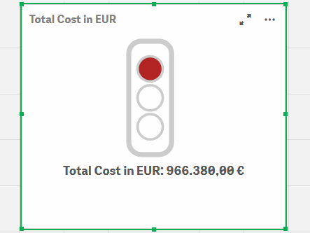
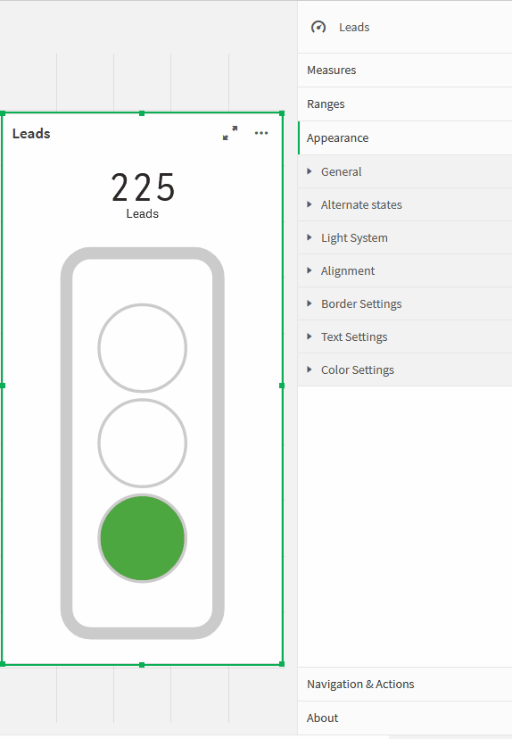
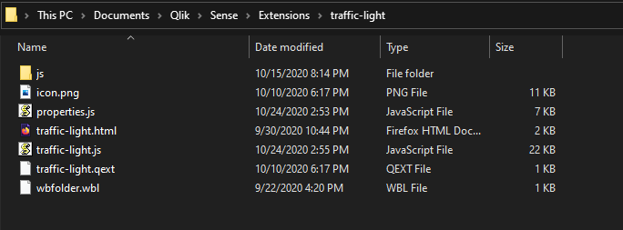
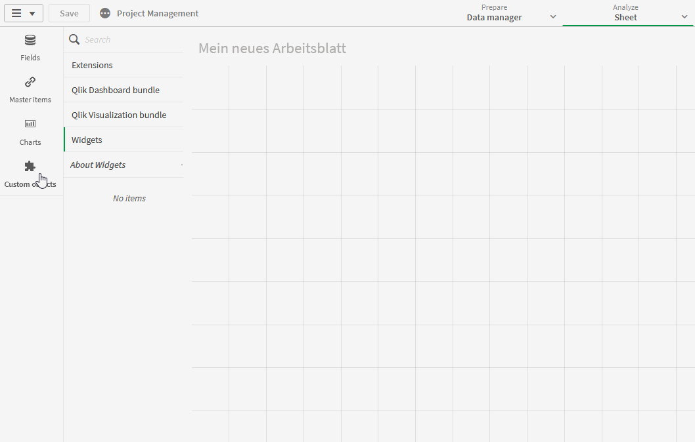
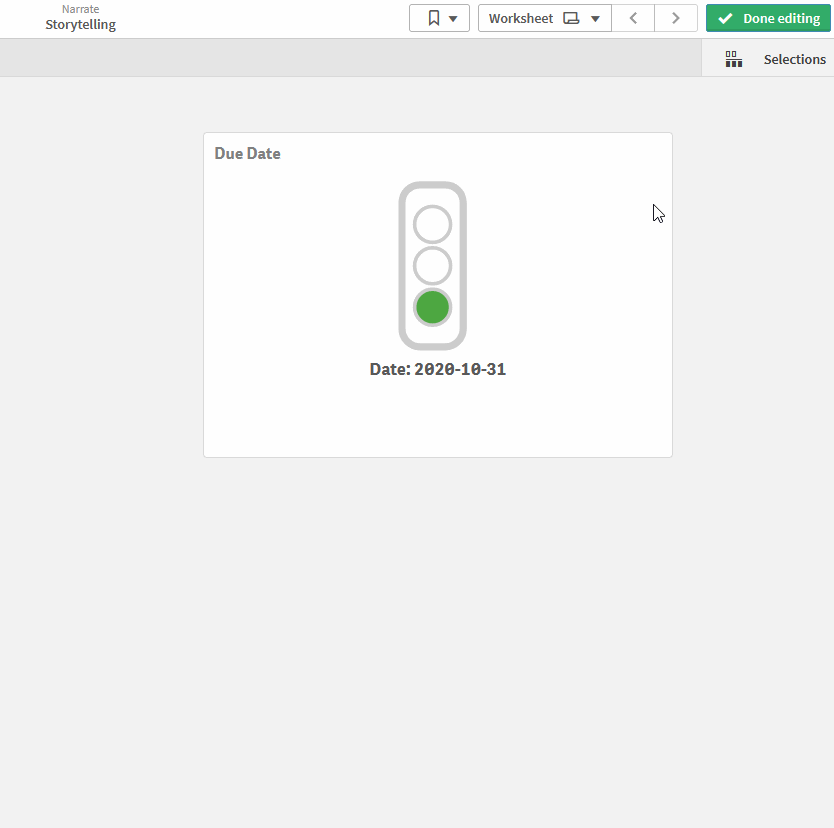
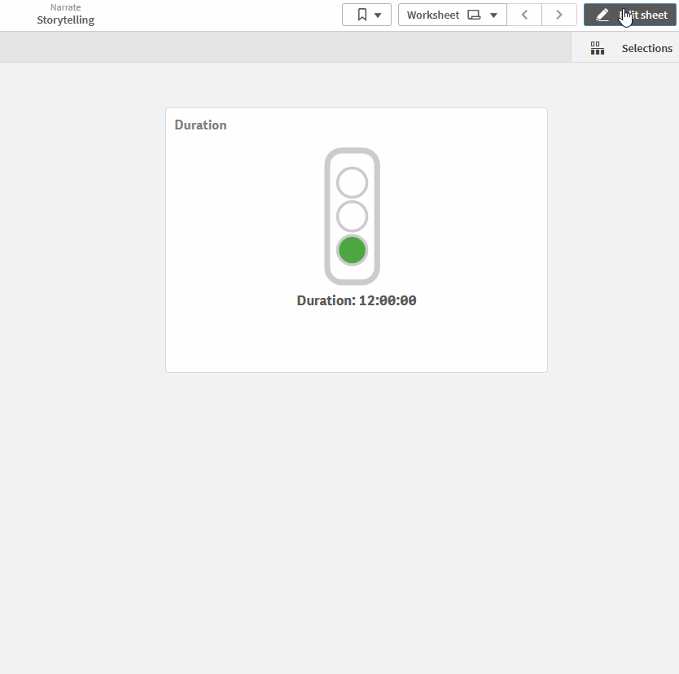
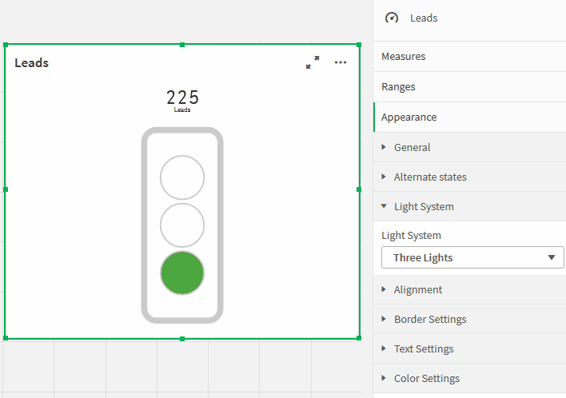
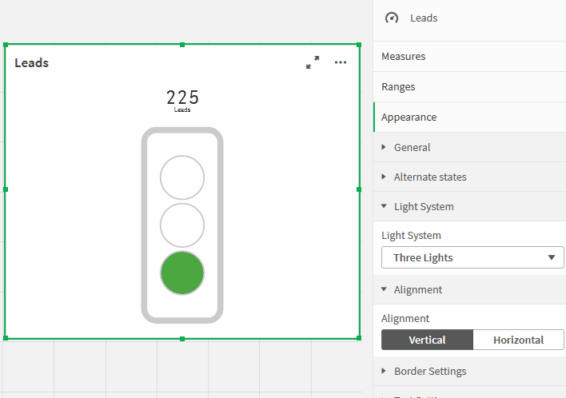
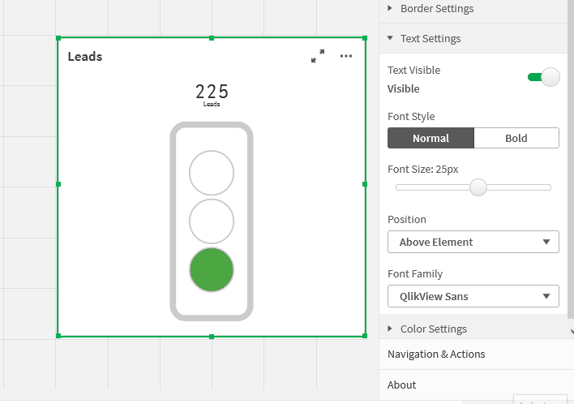

# Traffic Light – Extension for Qlik Sense

Visualization            |  Example Settings
:-------------------------:|:-------------------------:
  |  

## Introduction

Keeping track of your project status and milestones with this visual
traffic light solution! This is the major objective of this traffic
light extension. "Traffic Light" is a highly customizable Qlik Sense
Extension for monitoring your KPIs. Multiple settings like horizontal
and vertical alignment or a two/three light system adapts this extension
to your reporting needs.

This extension can also be used for monitoring and indicating thresholds
for all types of physical measures, quality indicators and divergences
in general. With this, it can be applied to a broad number of uses
cases, that occur different businesses. The following listing shows a
selection of possible uses cases, that had been already implemented:

**Project Management**: Show Project Status in a Project Management
Dashboard

**IT**: Indicate exceeding of system performance threshold in an
IT-Performance-Monitoring Tool

**Infrastructure:** Show buildings, where a threshold for incidents and
repairs is exceeded, which leads to a general evaluation of heavy
maintenance

## Installation

1.  Download the [“Traffic Light
    Master”](https://github.com/leaplytics/traffic-light-qlik-sense/tree/master)
    repository from GitHub

2.  Unzip the downloaded file

3.  Place the folder in your Qlik Sense Extensions directory on your
    computer
    (*C:\\Users\\YourUserName\\Documents\\Qlik\\Sense\\Extensions*) or
    import it with Qlik Management Console (QMC)

There is also a general [installation guide available for Qlik
Sense](https://help.qlik.com/en-US/sense-developer/September2020/Subsystems/Extensions/Content/Sense_Extensions/Howtos/deploy-extensions.htm).

## Getting Started

Open Qlik Sense and the relevant app, where you want to use the “Traffic Light”
extension. Open your worksheet in edit mode and you will find the
extension within the “Custom Objects” section. Drag and Drop the
extension to any area on your dashboard (*You can change the appearance
of the extension later in the advanced settings*).

In the following chapters, you will learn how to use LeapLytics “Traffic
Light” extension and how to customize it to your needs by using the
properties correctly.

### Measures

The measure defines the value, that is processed together with the
ranges to create the colors of the traffic light. The measure can have
all possible QlikSense-Formats. You can add a measure like this:

1.  Click the “Add measure” button in the properties panel under the
    section “Measure” or by clicking the “Add measure” button inside the
    extension window on your dashboard

2.  Choose a measure from the dropdown list and click on it

3.  (Optional): Choose the right aggregation for your needs (Sum, Avg,
    Min, Max, etc.)

**When using time formats, it must be ensured, that the format is set
according to the format of the processed measure.**

### Ranges

When “Ranges” is clicked, you can define the individual ranges with “Min” and “Max” values in order to set the intervals of each colour.

***Please use the format-formulars according to the measure-formular.***

## Appearance Settings

### Light System

You can choose between a three-, two- and one-light system.

*Keep in mind, that the option to define the yellow interval is hidden, if you select „Two Lights“ in the “Light System” properties (all described use cases can be applied)*

### Alignment

You can use the alignment switch to bring your traffic light in a vertical or horizontal position (Vertical alignment is set by default). 

### Border Settings

With the border setting, you can adjust the appearance of the traffic
light to your needs.

“Traffic Light Border” enables or disables the outer borders of your
system.

“Traffic Light Shades” enables or disables the inner borders of the
lights.

### Text Settings

You can apply changes to the text within the “Text Settings” properties.  

Show or hide text with the “Text Visible” switch. 

Choose between normal and bold text style with the “Font Style” switch. 

Change the size of the text with the “Font Size” slider. 

Adjust text position within the extension with dropdown menu.  

You can change the font family with the dropdown menu.

### Color Settings

Within the “Color Settings” section, you can define your own specific colors by using the color pickers.

## Navigation & Actions

You can apply Navigation & Actions to your “Traffic Light” extension to navigate to QlikSense Sheets, websites, etc.  

Actions need to be activated with the corresponding button. 

“Traffic Light” supports two different navigation types:

### Button

Choose “Button” to add a button underneath your traffic light icon.  

You can rename the button by using the “Button Text” field. 

Enter a URL for a website or QlikSense Sheet you want to navigate to*. 

You can open the URL in the same window or in a separate tab by using the “Open in same window” checkbox. 

### Object
Choose “Object” to make the entire object clickable (“Button Text” field will be hidden). 

Enter a URL for a website or QlikSense Sheet you want to navigate to. 

You can open the URL in the same window or in a separate tab by using the “Open in same window” checkbox. 

## About

This Qlik Sense extension is developed by
[LeapLytics GmbH](https://www.leaplytics.de/).

### Compatibility 

This extension has been tested with:

[Qlik Sense
2021/11](https://help.qlik.com/en-US/sense-developer/November2021/Content/Sense_Helpsites/WhatsNew/What-is-new-QlikSenseDev.htm)

[Qlik Sense
2021/08](https://help.qlik.com/en-US/sense-developer/August2021/Content/Sense_Helpsites/WhatsNew/What-is-new-QlikSenseDev.htm)

[Qlik Sense
2021/05](https://help.qlik.com/en-US/sense-developer/May2021/Content/Sense_Helpsites/WhatsNew/What-is-new-QlikSenseDev.htm)

[Qlik Sense
2021/02](https://help.qlik.com/en-US/sense-developer/February2021/Content/Sense_Helpsites/WhatsNew/What-is-new-QlikSenseDev.htm)

[Qlik Sense
2020/11](https://help.qlik.com/en-US/sense-developer/November2020/Content/Sense_Helpsites/WhatsNew/What-is-new-developer-Nov2020.htm)

[Qlik Sense
2020/09](https://help.qlik.com/en-US/sense-developer/September2020/Content/Sense_Helpsites/WhatsNew/What-is-new-developer-Sept2020.htm)

[Qlik Sense
2019/09](https://help.qlik.com/en-US/sense-developer/September2019/Content/Sense_Helpsites/WhatsNew/What-is-new-developer-Sept2019.htm)

### Version History

#### Version 1.4.1.0
- Frontend License added

#### Version 1.4.0.0
- New API Design Usage

#### Version 1.3.0.1
- Added Automatic Number format support

#### Version 1.3
- Dynamic Resizing
#### Version 1.2
- Minor Bugfixes
#### Version 1.1
- Optimized space within horizontal alignment
- Added e-Mail Subscribtion Button

#### Version 1.0

- Initial Version

### Contact

For exclusive updates and release information, subscribe to [our E-Mail newsletter](https://www.leaplytics.de/subscribe_product/).

For further information, training material or use cases contact us via
our [contact form](https://www.leaplytics.de/kontakt/).

For bugs and troubleshooting, you can [file an
issue](https://github.com/leaplytics/traffic-light-qlik-sense/issues).

### Copyright 

Copyright (c) 2022 [LeapLytics](https://www.leaplytics.de/)