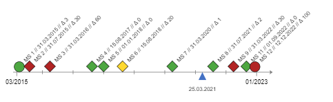
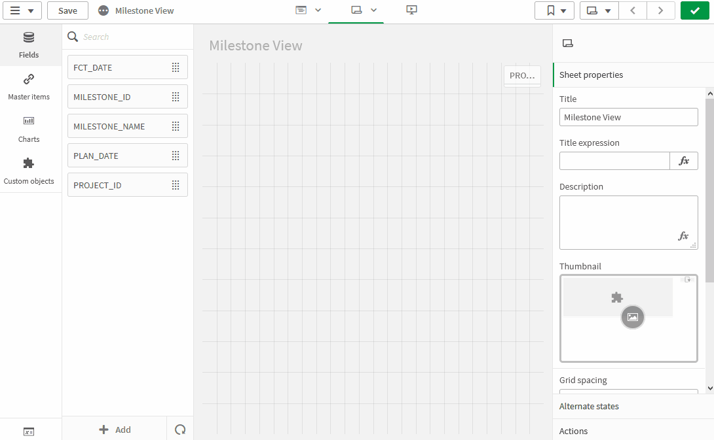
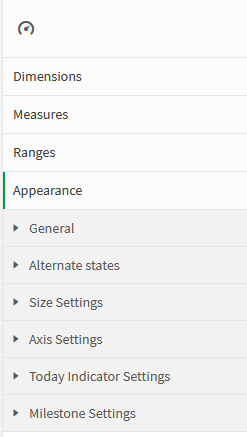
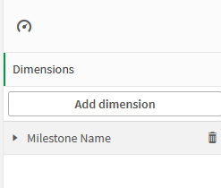
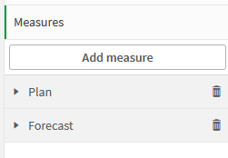
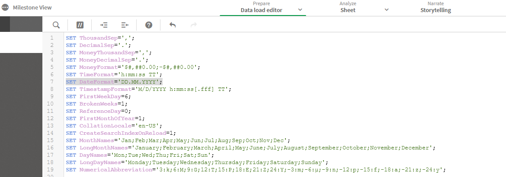
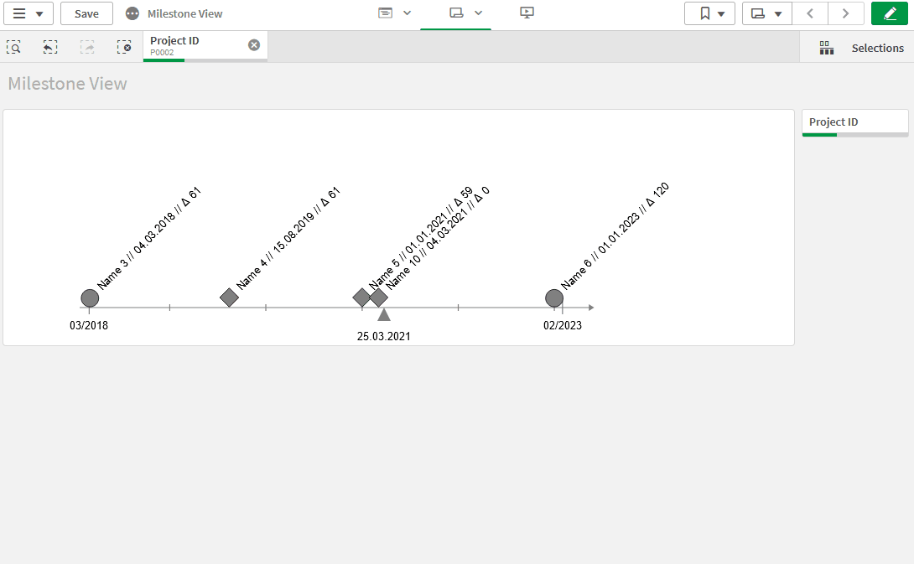
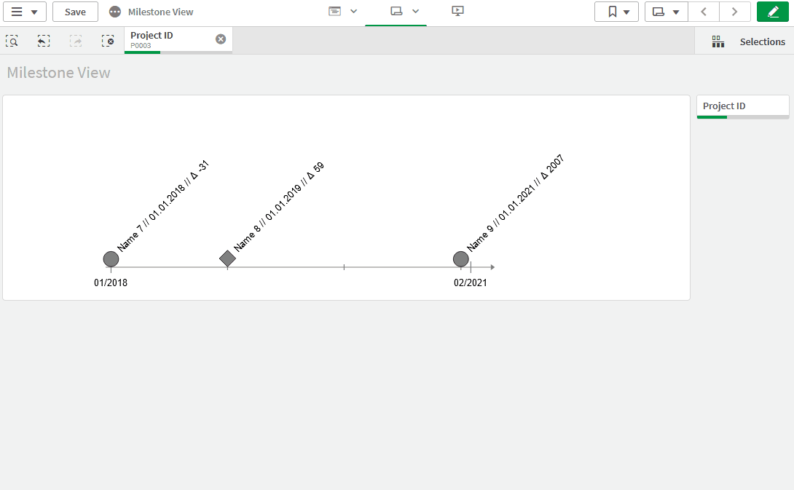
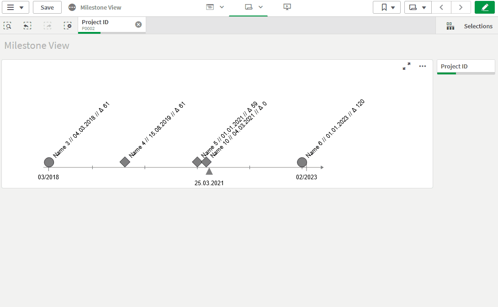

# LeapLytics Timeline – Extension for Qlik Sense

## Introduction
    
In all projects Milestones serve as relevant management metrics, providing the means to define project priorities, monitor progress and tell an overarching story, in which status your project is. With this extension, you are able to show the distribution of your milestones over the project runtime.

In addition, you are able to display relevant information like name, date and a date deviation, e.g. plan to forecast or actual to forecast, to our needs. With the plan-to-forecast deviation comes a colour coding, that gives a direct visual trigger. Individual settings allow you to adapt the extension on the dashboard to your needs. 

---

<h2 align="center">Pro Version</h2>

Interested in a <b>more flexible</b> with <b>even more features</b>? Check out our <a href="https://www.leaplytics.de/timeline-qliksense-offering/?utm_source=timeline&utm_medium=github&utm_campaign=above-the-fold" target="_blank">Pro Version here</a>!

---
## Installation

1.  Download the [“Timeline Master”](https://github.com/leaplytics/milestone-view-qlik-sense/tree/master) repository from GitHub

2.  Unzip the downloaded file

3.  Place the folder in your Qlik Sense Extensions directory on your computer (*C:\\Users\\YourUserName\\Documents\\Qlik\\Sense\\Extensions*) or import it with Qlik Management Console (QMC)

There is also a general [installation guide available for Qlik
Sense](https://help.qlik.com/en-US/sense-developer/November2020/Subsystems/Extensions/Content/Sense_Extensions/Howtos/deploy-extensions.htm).

## Getting Started

Open Qlik Sense and the relevant app, where you want to use the “Timeline” extension. Open your worksheet in edit mode and you will find the extension within the “Custom Objects” section. Drag and Drop the extension to any area on your dashboard (You can change the appearance of the extension later in the advanced settings). 

After you have placed an instance of the extension to your dashboard, the following properties panel will appear on the right side. The properties panel is separated into the following sections:

<ol>

<li>Dimensions</li>

<li>Measures</li>

<li>Ranges </li>

<li>Appearance</li>

<ol>
<li>Size Settings</li>
<li>Axis Settings</li>
<li>Milestone Settings</li>
</ol>

<li>About</li>
</ol>

In the following chapters, you will learn how to use LeapLytics “Timeline” extension and how to customize it to your needs by using the properties correctly.

### Dimensions

Only the first dimension will be displayed as output.

### Measures

You have two options for choosing the right date format:

**Option a)**

The date format in your dataset corresponds to the date format set in your load script. E. g. in the main section of your load script:

Then you can *keep the aggregation function* (i. e. Avg()) set by default by Qlik for a measure.

**Option b)**

The date format in your dataset **differs** to the date format set in your load script. Then you have to *remove the aggregation function* around your date field. E. g. different or unknown date format in your dataset.

### Advanced Settings

The Settings can be generally differentiated in three layers:

- Axis Settings
- Milestones on the Axis
- Today Indicator (only available in PRO version)

In addition the general size of the object can be adjusted (Size Settings).

#### Ranges

We provide **three** color classes (green, yellow, red). Define your delay in days for each class.

In order to catch outliers, the minimum green and maximum red value can be *left empty*. Grey milestones appear, when the delay is not in the three defined ranges or ranges are generally undefined.

#### Appearance

##### Axis Settings

For the axis-line, individual appearance with regards to line width, length or colour can be set. In addition, the text marks can be adjusted in font size and style.

##### Today Indicator

*Today Indicator: Only available in PRO version*

The today indicator is a visible sign for a certain date. This can be the current date or any other date given in the formular. Furthermore size, style and colour can be selected.

##### Milestone Settings

The Milestones on the axis show the defined colour coding from the range section. Furthermore, it can be set whether a start and end milestone is included. In addition three possible descriptions can be shown above the milestone itself. The visibility as well as size and style can be adjusted individually.

## About

This Qlik Sense extension is developed by
[LeapLytics](https://www.leaplytics.de/).

### Compatibility 

This extension has been tested with:

[Qlik Sense
2021/05](https://help.qlik.com/en-US/sense-developer/May2021/Content/Sense_Helpsites/WhatsNew/What-is-new-developer-May2021.htm)

[Qlik Sense
2021/02](https://help.qlik.com/en-US/sense-developer/May2021/Content/Sense_Helpsites/WhatsNew/What-is-new-developer-Feb2021.htm)

[Qlik Sense
2020/11](https://help.qlik.com/en-US/sense-developer/November2020/Content/Sense_Helpsites/WhatsNew/What-is-new-developer-Nov2020.htm)

[Qlik Sense
2020/09](https://help.qlik.com/en-US/sense-developer/September2020/Content/Sense_Helpsites/WhatsNew/What-is-new-developer-Sept2020.htm)

[Qlik Sense
2019/09](https://help.qlik.com/en-US/sense-developer/September2019/Content/Sense_Helpsites/WhatsNew/What-is-new-developer-Sept2019.htm)

### Version History

#### Version 1.0

- Initial Version

### Contact

For exclusive updates and release information, subscribe to [our E-Mail newsletter](https://www.leaplytics.de/subscribe_product/?utm_source=timeline&utm_medium=github&utm_campaign=below-the-fold).

For further information, training material or use cases contact us via
our [contact form](https://www.leaplytics.de/kontakt/?utm_source=timeline&utm_medium=github&utm_campaign=below-the-fold).

For bugs and troubleshooting, you can [file an
issue](https://github.com/leaplytics/milestone-view-qlik-sense/issues).

### Copyright 

Copyright (c) 2021 [LeapLytics](https://www.leaplytics.de/)

---

<h2 align="center">Pro Version</h2>

Interested in a <b>more flexible</b> with <b>even more features</b>? Check out our <a href="https://www.leaplytics.de/timeline-qliksense-offering/?utm_source=timeline&utm_medium=github&utm_campaign=below-the-fold" target="_blank">Pro Version here</a>!

---
