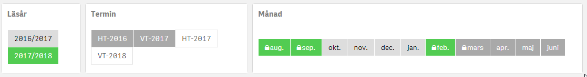

# Simple horizontal list extension for Qlik Sense 

This is a simple extension for making horizontal listbox in Qlik Sense build with AngularJS.
The extension is tested in version April 2018 - November 2020.

### Updates
* 2020-09-16 - Fix lock icon and possibility to create custom CSS in row level.
* 2021-01-13 - Add field label
* 2021-01-25 - Fixed align cell values to desired direction

### Tip
Add ```flex:1;``` to the input field **Custom CSS for cell inline-style** and all values will stretch to one single row.

## Screenshot

