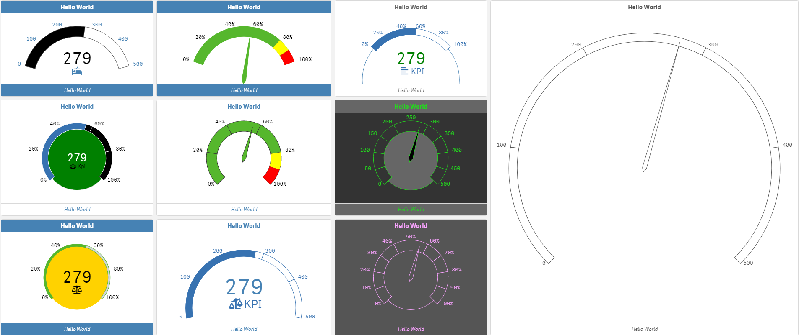
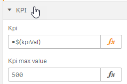
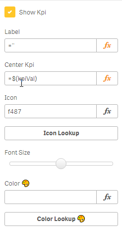
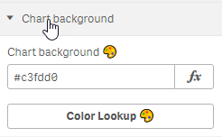
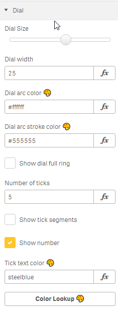
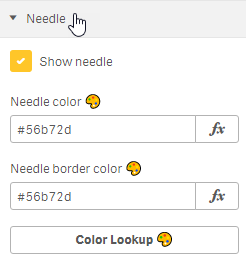
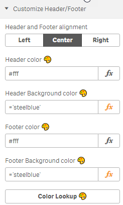

# Qlik Sense D3 Circular Gauge Designer

### Use template created in demo app to start designing gauge

# Measure configuration (Data)

### Main Kpi

### Center Kpi

# Appearance

### Chart background

### Gauge Setting (Dial)
configure the dial size, color, #ticks , display value and tick text color
 

### Kpi segments
Add a segments. i.e. good range and bad range.
 
 

### Needle
Configure the needle display and color.
 

### Customize Header/Footer

